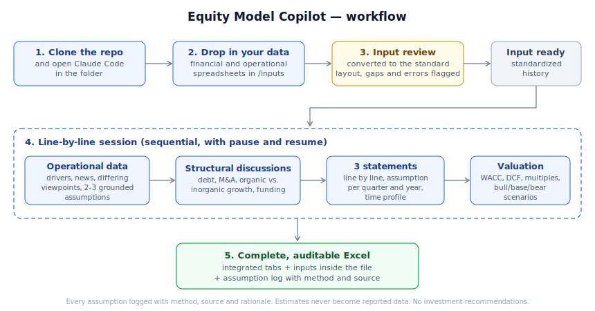

# Equity Model Copilot

A modeling copilot for Brazilian equities. You provide the company data; the system organizes the history into standardized IFRS statements and sector-specific operational modeling, discusses every projection assumption with you (with drivers, news and divergent viewpoints) and delivers a complete, integrated, auditable Excel model, all the way to the valuation tab.

**Core principle: the LLM reasons, the code calculates.** All arithmetic lives in real Excel formulas generated by deterministic code. The AI discusses, proposes and documents; it never does the math.



## How it works

1. **Clone the repo and open Claude Code in the folder** (Claude app or PowerShell: `cd` into the folder and run `claude`). `CLAUDE.md` gives the agent its context automatically.
2. **Drop your data into `/inputs`**: spreadsheets with hard data, financial (3 statements, debt and the like) and operational, in whatever layout you already have.
3. **Input review**: the system converts everything to the sector's standard template, flags what is missing, checks it against the company's public data (unit errors, typos) and suggests data you didn't use. Nothing is corrected without your approval.
4. **Line-by-line session** (sequential, with pause and resume): starts with the operational data, moves through the structural discussions (debt, M&A, organic vs. inorganic growth) and the three statements, and ends with valuation (WACC assumption by assumption, DCF, multiples, bull/base/bear scenarios). For each line the copilot presents the driver, brings news and arguments from different perspectives, and suggests 2-3 grounded assumptions (e.g. +3%, +5%, +10%). You accept one or type any value you want, and discuss the time profile (a single assumption, or short-term growth with stabilization).
5. **Delivery**: an `.xlsx` in `/models` with all tabs integrated with one another and the input tabs inside the file, history 100% formula-linked, and an assumption log recording method, source, date and rationale for every decision.

## What is expected from you

- Provide the data (the system doesn't collect it; public sources only, and estimates are never presented as reported data)
- Decide every assumption: the copilot grounds and suggests, but no number goes in without your approval
- Review the final model as you would review the work of a very fast junior analyst

## Multi-company coverage and learning

The `/coverage` folder organizes sectors and companies (`/coverage/<sector>/<company>`). The system keeps three layers of knowledge in versioned files: `analyst_profile.md` (how you work, updated with your approval), one `_sector.md` per sector (shared assumptions such as Brent and FX, for consistency across companies in the same sector) and the per-company assumption log. Open a new Claude Code conversation per company; quality doesn't degrade because context is rebuilt from these files.

## Repo structure

| Folder | Contents |
|---|---|
| `engine/` | Python engine: template generators, integrated model build, validations |
| `templates/` | Sector templates (YAML + blank input workbooks). Current sectors: Oil & Gas, Telecom |
| `inputs/` | Your data, per company (local, outside git) |
| `models/` | Generated models (local, outside git) |
| `coverage/` | Per-sector and per-company knowledge (profile, theses, logs) |
| `knowledge/` | Per-line projection method cards (distilled from market practice) |
| `docs/` | Specification, calibration notes and figures |

## Quickstart

```powershell
git clone https://github.com/<your-username>/equity-model-copilot.git
cd equity-model-copilot
python -m venv .venv && .venv\Scripts\activate
pip install -r requirements.txt
claude   # opens Claude Code; ask: "read CLAUDE.md and let's model company X"
```

Quick engine test without real data:

```powershell
python engine/build_input_template.py
python engine/dev_fill_synthetic.py templates/input_template_oil_and_gas.xlsx inputs/SYNTH_inputs.xlsx
python engine/build_model.py inputs/SYNTH_inputs.xlsx models/SYNTH_model.xlsx
```

## Model conventions

Columns with quarters and the year closing each block (`1Q24, 2Q24, 3Q24, 4Q24, 2024, 1Q25...`); blue = input, black = formula, green = link between tabs; revenues positive, expenses negative; balance check in every column; assumptions always in their own cells (never constants inside formulas); no macros, no named ranges, no circularity (interest on opening balances).

## Status and roadmap

Engine v0 validated end-to-end in two sectors (O&G with synthetic data; telecom with real reported data and a guidance-based assumption session). Being built, in this order: declarative sector templates, revolver and dynamic debt, dynamic working capital, EV→equity bridge, assumption persistence on re-build, full Valuation tab, local web interface for the session (via MCP + Claude Code). Details in `docs/project_specification.md`.

## Compliance

Public sources only. Every estimate is labeled with method and source. Target price is analytical output with a disclaimer. **This project does not produce investment recommendations.**
